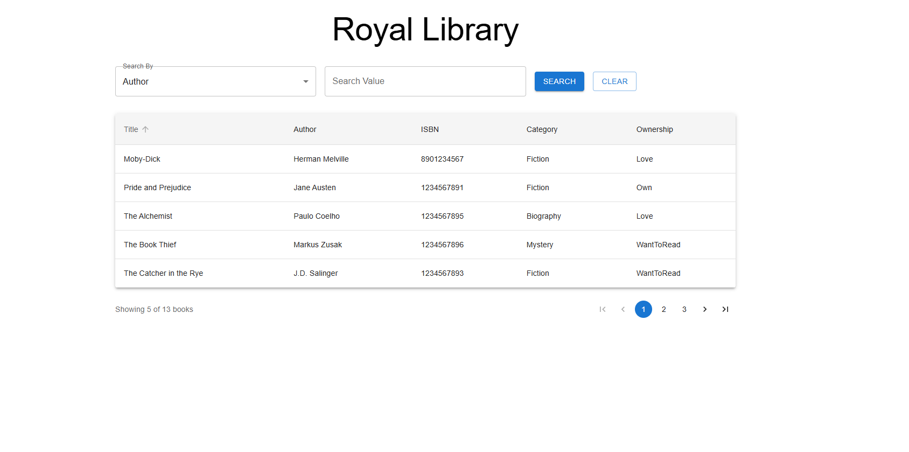

# Royal Library

This project is a personal book library database, developed as a 2-hour coding challenge for Torc. It allows you to store information about books you own, love, or want to read, and search for them by Author, ISBN, Title, or Ownership status. You can also sort the results by various criteria.

[](https://youtu.be/Zfw8s_9a13c)

<!--  -->

## Features

- **Backend API:** Developed with .NET 9.0 and Entity Framework Core, providing search, filtering, pagination, and sorting functionality for books.
- **Frontend Web Application:** Built with React, TypeScript, and Material-UI, offering a user-friendly interface to search and display book information.
- **Database:** PostgreSQL, managed with Docker Compose for easy setup.
- **Layered Architecture:** Backend is refactored into Controller, Service, and Repository layers for better separation of concerns and maintainability.
- **Unit Tests:** Comprehensive unit tests for the Service layer ensure business logic correctness.

## Setup and Run

Follow these steps to get the project up and running on your local machine.

### Prerequisites

- [.NET 9.0 SDK](https://dotnet.microsoft.com/download/dotnet/9.0)
- [Node.js and npm](https://nodejs.org/)
- [Docker](https://www.docker.com/get-started)

### 1. Clone the repository

```bash
git clone <repository_url>
cd torc_project
```

### 2. Run the Application

To get the entire application (database, backend API, and frontend) up and running with a single command, navigate to the project root directory and execute:

```bash
docker compose up -d && dotnet ef database update --project BookLibrary.Api -s BookLibrary.Api && dotnet run --project BookLibrary.Api & cd frontend && npm install && npm start
```

**Note:**
*   This command will:
    *   Start the PostgreSQL and pgAdmin containers in the background.
    *   Apply database migrations and seed initial data.
    *   Start the backend API in the background.
    *   Install frontend dependencies and start the React development server.
*   You might need to run `npm install` in the `frontend` directory separately if it fails during the combined command.

### Accessing the Application

*   **Frontend:** Accessible at `http://localhost:3000`
*   **Backend API:** Listening on `http://localhost:5043`
*   **Swagger UI:** Access the API documentation and test endpoints at `http://localhost:5043/swagger/index.html`
*   **pgAdmin:** Accessible at `http://localhost:5050` (email: `admin@admin.com`, password: `admin`).

### Filtering and Ordering

The application allows you to filter books by:
-   **Author**
-   **ISBN**
-   **Title**
-   **Ownership Status:** (Own, Love, Want to Read) - supports multiple selections.

You can also order the search results by:
-   **Title**
-   **Author**
-   **ISBN**
-   **Category**

### Running Tests

Unit tests for the backend Service layer are available. To run them, navigate to the project root directory and execute:

```bash
dotnet test BookLibrary.Tests/BookLibrary.Tests.csproj
```

## Deployment to Kubernetes (AKS)

This section guides you through deploying the application to an Azure Kubernetes Service (AKS) cluster.

### Prerequisites for AKS Deployment

*   [Azure CLI](https://docs.microsoft.com/en-us/cli/azure/install-azure-cli)
*   [kubectl](https://kubernetes.io/docs/tasks/tools/install-kubectl/)
*   An Azure Kubernetes Service (AKS) cluster configured and connected to your `kubectl`.
*   An Azure Container Registry (ACR) instance.

### 1. Build and Push Docker Images to ACR

First, you need to build the Docker images for the backend API, frontend, and database migrations, and push them to your Azure Container Registry. Replace `torcmydocitu.azurecr.io` with your ACR login server name.

#### a. Backend API Image

```bash
docker build -t booklibrary-api:latest -f BookLibrary.Api/Dockerfile .
docker tag booklibrary-api:latest torcmydocitu.azurecr.io/booklibrary-api:latest
docker push torcmydocitu.azurecr.io/booklibrary-api:latest
```

#### b. Frontend Web Application Image

Replace `http://YOUR_INGRESS_EXTERNAL_IP` with the external IP address of your Nginx Ingress controller in AKS. You can find this by running `kubectl get svc -n ingress-nginx ingress-nginx-controller -o jsonpath='{.status.loadBalancer.ingress[0].ip}'`.

```bash
docker build --build-arg REACT_APP_API_URL=http://YOUR_INGRESS_EXTERNAL_IP -t booklibrary-frontend:1.0.0 -f frontend/Dockerfile .
docker tag booklibrary-frontend:1.0.0 torcmydocitu.azurecr.io/booklibrary-frontend:1.0.0
docker push torcmydocitu.azurecr.io/booklibrary-frontend:1.0.0
```

#### c. Database Migrations Image

```bash
docker build -t booklibrary-api-migrations:1.0.0 -f BookLibrary.Api/Dockerfile.Migrations .
docker tag booklibrary-api-migrations:1.0.0 torcmydocitu.azurecr.io/booklibrary-api-migrations:1.0.0
docker push torcmydocitu.azurecr.io/booklibrary-api-migrations:1.0.0
```

### 2. Configure Azure Container Registry (ACR) Access for AKS

Your AKS cluster needs permission to pull images from your ACR.

#### Option 1: Attach ACR to AKS (Recommended if you have permissions)

```bash
az aks update -n <your-aks-cluster-name> -g <your-resource-group> --attach-acr torcmydocitu.azurecr.io
```
Replace `<your-aks-cluster-name>` and `<your-resource-group>` with your actual AKS cluster details.

#### Option 2: Use Image Pull Secret (If you lack permissions for Option 1)

1.  **Get ACR Admin Credentials:**
    ```bash
    az acr credential show -n torcmydocitu --query "{username:username, password:passwords[0].value}"
    ```
    Note down the `username` and `password`.

2.  **Create Kubernetes Secret:**
    ```bash
    kubectl create secret docker-registry acr-secret --namespace torc \
      --docker-server=torcmydocitu.azurecr.io \
      --docker-username=<your-acr-username> \
      --docker-password=<your-acr-password>
    ```
    Replace `<your-acr-username>` and `<your-acr-password>` with the credentials obtained in the previous step.

### 3. Deploy to Kubernetes

The Kubernetes manifests for all components (backend, frontend, PostgreSQL, Ingresses) are defined in `kubernetes.yaml`.

#### a. Update `kubernetes.yaml`

Before applying, ensure the `Cors__AllowedOrigins` in the `booklibrary-api-config` ConfigMap within `kubernetes.yaml` is set to your frontend's external URL (e.g., `http://YOUR_INGRESS_EXTERNAL_IP`).

```yaml
# ... (excerpt from kubernetes.yaml)
apiVersion: v1
kind: ConfigMap
metadata:
  name: booklibrary-api-config
data:
  ConnectionStrings__DefaultConnection: "Host=postgres;Port=5432;Database=booklibrary;Username=postgres;Password=postgres"
  Cors__AllowedOrigins: "http://YOUR_INGRESS_EXTERNAL_IP" # <--- UPDATE THIS LINE
# ...
```

#### b. Apply Manifests

```bash
kubectl apply -f kubernetes.yaml -n torc
```

### Database Migrations and Seeding

If you need to apply migrations or re-seed the database manually:

1.  **Apply Migrations:**
    ```bash
    dotnet ef database update --project BookLibrary.Api -s BookLibrary.Api
    ```
2.  **Seed Initial Data:** The initial data is seeded as part of the `AddBookSeedData` migration. If you need to re-seed or add more data, you can modify the `Sql/SeedData.sql` file in the `BookLibrary.Api` project and then apply the migration again (after potentially reverting the database to a state before the seed data migration).

## Future Improvements / Notes

- Implement functionality to add, edit, and delete books.
- Improve UI/UX with more advanced Material-UI components and responsive design.
- Implement user authentication and authorization.
- Further improve test coverage (e.g., integration tests, frontend tests).